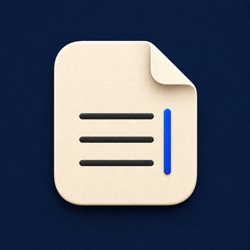
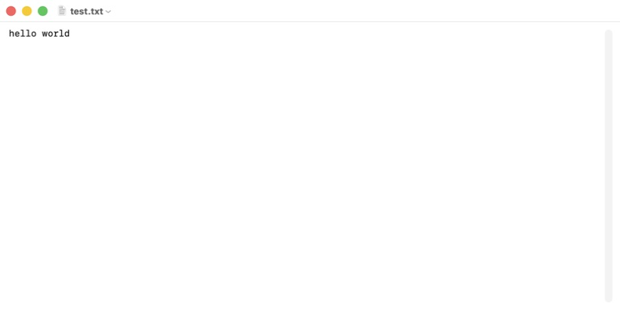

# TxtEditor

<p align="center">
  
</p>

TxtEditor 是一个极简的 macOS 原生纯文本编辑器，使用 SwiftUI 的文档架构实现。它只处理 `.txt` 文件，支持打开、编辑、保存和关闭后重新打开。

目前仅支持 UTF-8；无效的 UTF-8 文件会作为损坏数据拒绝打开。



## 功能

- 双击或按 `Cmd+O` 打开 `.txt`
- 使用原生 `TextEditor` 编辑纯文本
- 按 `Cmd+S` 保存，文件内容使用 UTF-8 编码
- 按 `Cmd+N` 新建文档并另存为 `.txt`
- 可在 Finder 中设为 `.txt` 的默认打开应用

范围刻意保持精简：不包含富文本、编码选择、语法高亮、多标签、查找替换或字数统计。

## 技术实现

- SwiftUI：`DocumentGroup`、`FileDocument`、`TextEditor`
- Foundation：UTF-8 编解码
- Uniform Type Identifiers：`UTType.plainText`
- `TxtCore`：与 UI 解耦的纯 Swift 读写逻辑
- 无第三方依赖

## 环境

- macOS 14 或更高版本
- 支持 Swift 6 的完整 Xcode

本项目已在 macOS 26.2、Xcode 26.6（17F113）上验证。

## 构建与运行

```bash
xcodebuild \
  -project TxtEditor.xcodeproj \
  -scheme TxtEditor \
  -configuration Debug \
  CONFIGURATION_BUILD_DIR="$PWD/Build" \
  build

open Build/TxtEditor.app
```

也可以直接用 Xcode 打开 `TxtEditor.xcodeproj`，选择 `TxtEditor` scheme 后按 `Cmd+R`。

## 黑盒测试

```bash
swift run --disable-sandbox BlackBoxTest
```

测试覆盖：中文 UTF-8 往返、空字符串往返、损坏 UTF-8 抛出 `DecodingError`，以及 `.txt` 扩展名识别。

## 安装和设为默认应用

1. 构建后，将 `Build/TxtEditor.app` 拖入 macOS 的“应用程序”文件夹。
2. 在 Finder 中右键任意 `.txt`，选择“显示简介”。
3. 在“打开方式”中选择 `TxtEditor`，点击“全部更改…”。

此后双击 `.txt` 即会使用 TxtEditor 打开；右键菜单的“打开方式”和“始终以此方式打开”中也会出现 TxtEditor。

## 目录

```text
Sources/TxtCore/        纯 Swift UTF-8 编解码与扩展名判断
Sources/TxtEditor/      SwiftUI 文档应用
Sources/BlackBoxTest/   可执行黑盒测试
Resources/              Info.plist 与 AppIcon 资源
Evidence/               手动端到端验收截图
```
